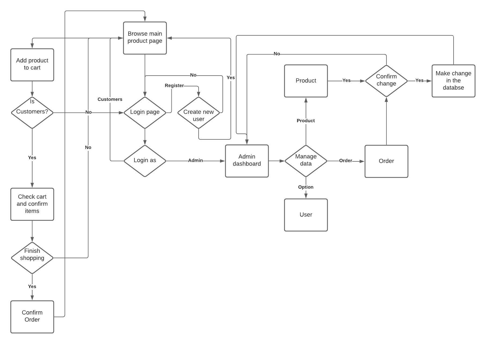
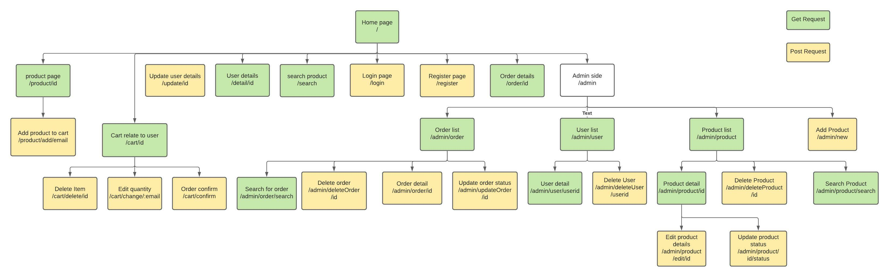
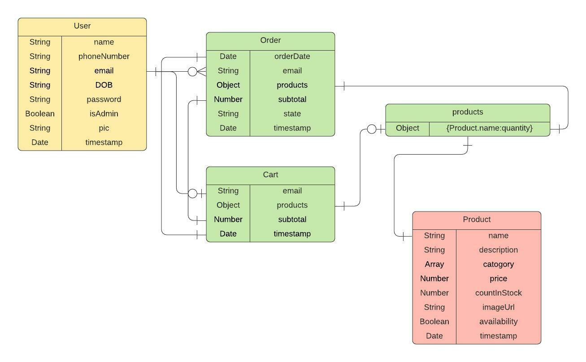
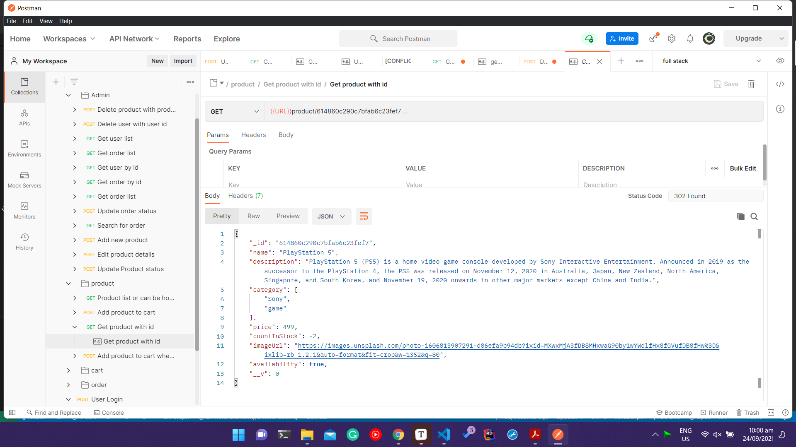
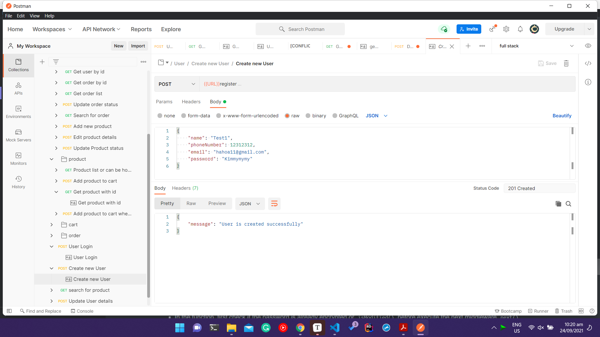
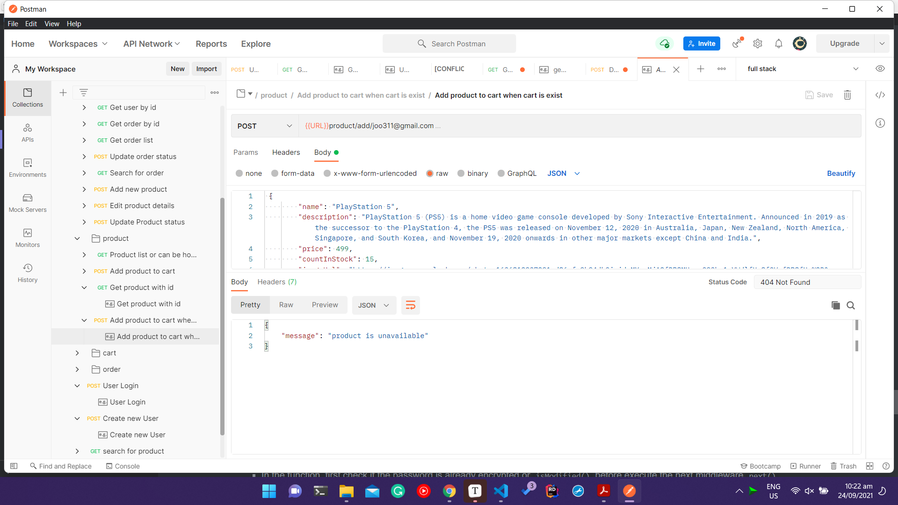

[TOC]

# Introduction

Due Covid-19 level 4, Nails Gate as business belonged in small and medium-size enterprises (SME) is making a zero profit while losing their clients at the same time, and after much consideration with consultation, the business owner decided to keep the business going and engage with online users by establish an e-commerce which at the current state would implement the online store concepts and could also apply other such as online booking, payment... The first state of the site would support user to register, login, browse, search for products, and make an order as well as view the order status. The owner would also require for an admin controller so the business can update, review products, users and orders while also add new items to the site.

With the requirements and research of the latest and most popular technology available, I would recommendation the MERN (MONGODB, ExpressJS, ReactJS, NodeJS) stack to develop full-stack web application for the business.

## 1. Web App Server-Side structure and functional modules 

Draw the hierarchy diagram to proper indicate and describe the web app server-side structure and all functional modules. You may have brief explanation on each module

### Flow Chart:



### Web App hierarchy:



### Database design:



## 2. Web App Server-Side Manual

The manual is focus on backend so instead of backend and frontend folder at the root directory, we will work directly with backend at root directory and all the files and folder can be moved into backend or Server-side folder afterward.

***<u>IMPORTANT</u>*** An example of request and response of most routes is created and stored in `src` folder as `HTTP Requests.postman_collection.json`, the file can be imported and read in Postman software for example and better understand.

### Set up environment

####  Important Packets

\- `Node` provides backend environment for the application

\- `Express` middleware is used to handle requests, routes, and session

\- `Mongoose` schemas to model the application data

\- `Bcrypt` provides encryption for password allow better security

\- `dotenv` is used to hide the secret or important details

#### Install packets

When clone or edit the project locally, it is recommend to perform  `npm i` to install the dependencies as well as getting its latest version.

For creating new project or working on new branch while using the above dependencies, please run line 2 and 3.

```bash
npm i
npm i mongoose express dotenv bcrypt 
npm i --dev nodemon 
```

#### Setup packet.json file

The server can be setup with different script to run different set up such as 

```json
"scripts": {
        "start": "nodemon server.js",
        "server": "nodemon backend/server.js",
        "client": "npm start --prefix frontend",
        "dev": "concurrently \"npm run server\" \"npm run client\"",
        "data:import": "node backend/dataSeeder.js"
    },
```

- `start `- start the server.js and can be changed to run any file with nodemon
- `server` - start the backend of the application
- `client` - start the front end or client side of the application
- `dev` - start both front end and back end to see if any errors occurs
- `data:import` - import the data from `dataSeeder.js` to populate the database

The command can be run with `npm run <script>`

#### dotenv file

Create .env file that include the:

- MONGO_URI - uri provided from Mongo dB
- JWT_SECRET - Json web token for session and authentication
- SESSION_SECRET - secret key to create express session
- SESSION_TIME - maximum time for a session ( in millisecond)
- OTHER API
- PORT - port number

### Setup the server

#### Setup App, Port

- Start by creating `server.js` at the root level along with `packet.json` and `.env`
- Import express module as well as connect to dotenv
- Start an instance of app with `express()`
- Start the app with `app.listen`

Example snippet

```javascript
require('dotenv').config();
const express = require("express")
const app = express();
const PORT = process.env.PORT || 3000 // if reading .env file fail => running on port 3000
app.listen(PORT, () => console.log(`Server running on port ${PORT}`))
```

*Note: `process.env.<Information>` would read the secret from `.env` file

#### Setup database connection

- Create a folder at root directory named config
- Create `db.js`
- Import mongoose module as well as dotenv
- Create a function named `connectDB` and exports it
- Inside `connectDB` connect the database with `mongoose.connect(uri)` using try catch

Example snippet: 

```javascript
require('dotenv').config()
const mongoose = require('mongoose');
const connectDB = async() => {
    try {
        await mongoose.connect(process.env.MONGO_URI, {
            useNewUrlParser: true,
            useUnifiedTopology: true
        });
        console.log("MongoDB connection Success")
    } catch (e) {
        console.error("MongoDB connection Failure")
        process.exit(1)
    }
}
module.exports = connectDB;
```

- Afterward go back to `server.js` and connect to database after initiate the app by calling function `connectDB()`
- Test the connect by running either `node server.js` or `npm run start`. The connect should be established at specific port as well as MongoDB connection

### Setup MVC (Model, View, Control)

First create 4 folders at root directory :

- data (optional)
- controller
- routes
- models

#### Create Models

This step will create the backbone of the database which is equivalent with creating table in SQL so design and setup before starting building models is important. In models folder, create `<model name>.js` such as `product.js` then :

- Import `Schema` and `model` from mongoose
- Create the model by making a `new` instance of `Schema` and save the value in a variable named `productSchema`
- Within Schema, we will need to pass an object with key and value are the information field and datatype or other details of the field such as `name:{type :String, required:true}`. The datatype is relate some JavaScript data type such as String, Number, Array, Object, Boolean.
- Afterward, we also need to store the Schema as well as the collection (Mongo dB name for table) name in a constant before exports

Example Snipper:

```javascript
const {Schema,model} = require("mongoose");

const productSchema = new Schema({
    name: {
        type: String,
        required: true,
    },
    description: {
        type: String,
        required: true,
    },
    category: {
        type:Array,
        required: true
    },
    price: {
        type: Number,
        required: true,
    },
    countInStock: {
        type: Number,
        required: true,
    },
    imageUrl: {
        type: String,
        required: true,
    },
    availability: {
        type: Boolean,
        required: true,
        default: true,
    }
},{timestamp:true});

const Product = model("Product", productSchema);
module.exports = Product
```

The same can be used to apply for User, Cart and Order

#### Create Controller

Controller will using the model to connect to database to process data from request as well determine the response. In controller folder, create `<model name>Controller.js` such as `productController.js` then :

- Import the models relate the request data
- Create an `async function` with `req` and `res` as parameter
- Using `try catch` and `await` to resolve any promise
- Using Mongoose method to interact with mongo dB through model such `findOne`, `updateMany`,`insertMany`...
- Create response with appropriate status code as well as message or new data to confirm the controller working.

```javascript
const Product = require('../models/product');
const getProductById = async(req, res) => {
    try {
        const currentProduct = await Product.findById(req.params.id);
        res.status(302).json(currentProduct)
    } catch (e) {
        console.error(e);
        res.status(500).json({ message: "server error" })
    }
}
```

*Note:

- For complete list of status code click [here](https://developer.mozilla.org/en-US/docs/Web/HTTP/Status)
- `req.body` is the data input in the body of the request
- `req.params` is the  argument from the route
- To test the `req.body` and `req.params` without building view, Postman is recommended.

#### Create Views

The Views can be created using most template handler such as `pug` or  `ejs`. The file structure the webpage need to be in views folder and specify the view engine in `server.js`.

Afterward. it is also important to setup the static content such as image, JavaScript, CSS files in public folder

Example for setup views: 

```javascript
// setting up the view
app.set("views", path.join(__dirname + "/views"));
app.set("view engine", "pug");
// static contents
app.use("/static", express.static(path.join(__dirname + "/public")));

```

### Setup Router

The router will determine the path of the request as well as how to handle the data such as `GET` request would receive the data without changing it which suit search and get specific information. On another hand,  `POST` request would send the data and update the information. In routers folder, create `<model name>Routes.js` such as `productRoutes.js` then :

- Import an `express` module then create a `router` constant with `express.Router()`
- Import the async function from the relate controller
- Start a router with HTTP request such as `router.get` then pass in the route as well as the async function relate to the specific routes
- Export the router

Example snippet:

```javascript
const express = require("express")
const router = express.Router();
const {
    addItem,
    getProductById
} = require("../controller/productsController")

//desc, get a product by id from db
//route get /products/:id
//access public
//status: working
router.get('/:id', getProductById)

module.exports = router
```

- Afterward, connect the routes to the `server.js` by store the route in a constant and run it with `app.use`

```javascript
const productRoutes = require("./routes/api/productRoutes");
app.use("/product", productRoutes)
```

- To test the route, we need to get the app run with either `node server.js` or `npm run start`, run Postman and enter the testing route and hopefully the correct response will come:



More examples:






### Other setup

#### Encryption and Authentication

By using `bcrypt`, we can encrypt the password to protect the user information and increase the level of security. 

##### Encrypt password

In order to encrypt the password, we need to work directly with the user model or `userSchema`

- In models folder, open `user.js` and import `bcrypt` module under the `mongoose` import
- Using `userSchema.pre()` and pass in the action `‘save’` and a call back function. This line of code would excuse the call back function before the action save (create or update)
- In the function, first check if the password is already encrypted or `isModified()` before execute the next middleware `next()`
- Determine the encrypt round with `bcrypt.genSalt(<number of round>)` then encrypt the password with `bcrypt.hash(this.password,<encryption round)`.

Example snippet: 

```javascript
userSchema.pre('save',async function(next){
    //check password is modified before moving on to next callback
    if(!this.isModified('password')){
        next();
    }
    // bcrypt functionality to encrypt password
    const salt = await bcrypt.genSalt(10);
    this.password = await bcrypt.hash(this.password,salt)
})
```

##### Authentication

With authentication, for user to login, instead decrypt the password, we can create a method for `userSchema` to match the provided password and the encrypted password.

- add a method to match password with `userSchema` with `userSchema.methods.matchPassword` and pass in an async function which take the provided password as argument
-  Run `bcrypt.compare()` and return true or false comparing entered password and password in the database

Example snippet :

```javascript
userSchema.methods.matchPassword = async function (enteredPassword) {
    return await bcrypt.compare(enteredPassword, this.password)
}
```

#### Session

Session would help user experience with browsing the webpage as with session, there will be less data travel back and forward for authentication as well as confirmation as user can confirm most request within their power and get the response right away while the request to database is made in the background.

While it is a work in progress as it would require further research but here is an example to set up session:

```javascript
app.use(
    sessions({
    secret: process.env.SESSION_SECRET,
    saveUninitialized: false,
    cookie: { maxAge: parseInt(process.env.SESSION_TIME) },
    resave: false,
    })
);
```

Afterward, we can bind the session with user Id or email.

```javascript
const currentUser = await User.findById(req.params.id)
req.session.userId = currentUser._id
```

## 3. Reference

- “HTTP Response Status Codes - HTTP | MDN.” Accessed September 22, 2021. https://developer.mozilla.org/en-US/docs/Web/HTTP/Status.
- JavaScript Mastery. *Full Stack MERN Project - Build and Deploy an App | React + Redux, Node, Express, MongoDB [Part 2/2]*, 2020. https://www.youtube.com/watch?v=aibtHnbeuio.
- The Full Stack Junkie. *Full Stack ECommerce Cart Build (React, Redux, Node, Express, MongoDB)...From Scratch💥*, 2020. https://www.youtube.com/watch?v=0divhP3pEsg.
- RoadsideCoder. *Complete User Authentication in React JS , Node, Express, MongoDB with JWT - MERN Stack Tutorial #10*, 2021. https://www.youtube.com/watch?v=iw5RSIflYGU.

